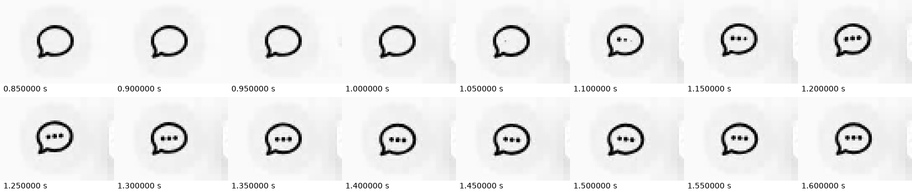
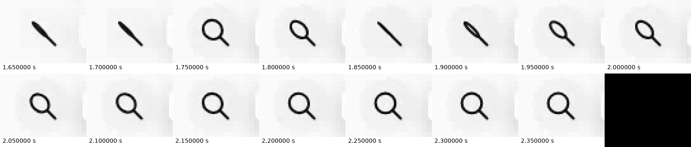
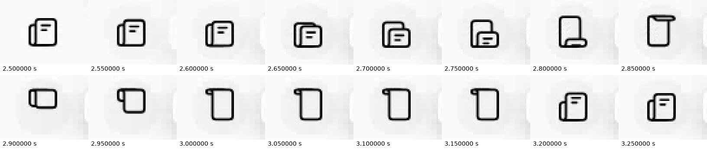
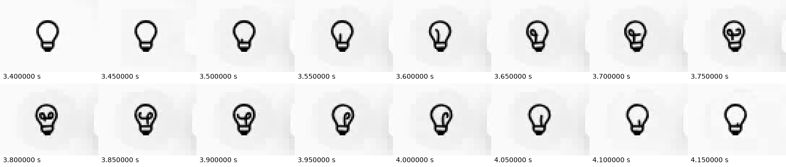
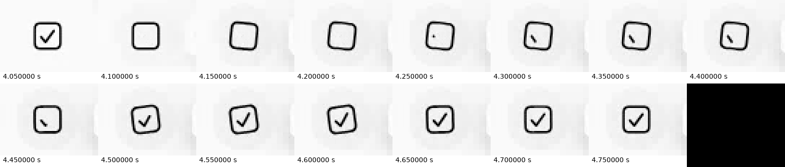
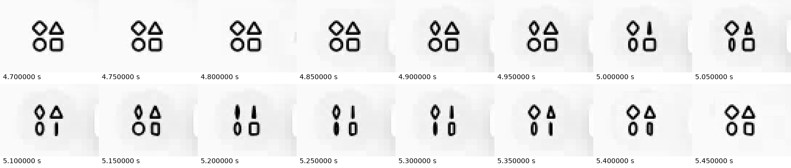

# Muse sidebar motion study

Research date: **2026-09-21**. This is an original analysis of an owner-supplied recording and publicly accessible Muse assets. It is a reference case, not a requirement to reproduce Muse in every project.

## Evidence and method

The supplied recording is **11.328 seconds**, **1851 × 1078**, with **240 decoded video frames** and variable frame timing. Its nominal reported frame rate is 1000/1; that is not a meaningful claim of 1000 captured frames per second. The analysis uses visible frame timestamps and 50 ms filmstrip samples. Resampling can duplicate or omit original frames, so the intervals below locate visible behavior rather than establish exact source animation duration or input latency.

The narrow rail is approximately 68 pixels wide in this recording. Its main icon centers remain approximately 56 pixels apart. These are captured-image measurements, not proven CSS dimensions: browser zoom and device scale are unknown. The icon-only crops below exclude the surrounding conversation and account content. The original recording and full-page captures are not distributed with this skill.

Live public inspection of [muse.ai](https://muse.ai/) reached the landing/sign-in experience. The authenticated sidebar was not directly operated. The supplied recording is therefore the primary evidence for the sidebar gestures. The official [design article](https://introducing.muse.ai/) and [product tour](https://www.youtube.com/watch?v=wHn0hTjvFoo) provide product context, not exact hover timing.

## What the recording establishes

| Icon | Visible interval in the recording | Observed gesture | What stays stable | Confidence/limits |
|---|---|---|---|---|
| Chat | About 1.05–1.20 s to reveal; dots remain visible through about 1.60 s | Three internal dots appear in sequence inside the speech bubble | Bubble location and surrounding button | High confidence in dot reveal; long-hover replay policy is not shown |
| Search | About 1.60–2.15 s | Magnifier repeatedly narrows to an edge-like diagonal and opens back into a lens | Center and control geometry | High confidence in flatten/turn appearance; 3D implementation is inferred |
| Feed | About 2.60–3.20 s | Foreground sheet moves and folds through edge-on shapes, then returns to a document with lines | Rail position; layered-paper identity | High confidence in sheet choreography; not a whole-row wobble |
| Ideas | About 3.50–4.15 s | A curved internal filament grows, curls through the bulb, and recedes | Bulb outline and base | High confidence in internal drawing; exact path data unavailable |
| Goals | About 4.10–4.75 s; another pass around 5.4–5.9 s | Check briefly disappears, box tilts, check redraws, box settles | Button center and outer hit area | High confidence in sequence; exact angle and easing not established |
| Library | About 4.85–5.5 s, with recovery afterward | Four small shapes flatten/turn at different times, then recover | Overall four-position arrangement | High confidence in local stagger; individual timing offsets approximate |

Several expressive gestures occupy roughly **half a second to seven-tenths of a second** of visible playback. That does not imply a navigation delay of the same length. The footage does not expose exact input timestamps or request timing.

### Chat

### Search

### Feed

### Ideas

### Goals

### Library

Read each strip left to right across its first row, then its second row. Black padding at the end of a strip is an unused tile, not an interface state.

## Surface, tooltip, and navigation observations

- The icon rail stays anchored while the main content changes between Chat, Goals, and Feed.
- A quiet rounded surface is visible around the active/hovered icon. In some moments the current Chat surface remains while another icon animates, supporting the distinction between selected and hovered state.
- Labels appear to the right as small tooltips; Chat and Search include keyboard shortcuts. Their exact initial delay, inter-tooltip grace period, and focus behavior cannot be measured confidently without pointer/focus event timestamps.
- The recording shows a Feed loading state followed by content. It does not establish a specific page-transition duration or easing curve.
- It does **not** demonstrate expanded-sidebar collapse, modal focus handling, mobile behavior, reduced motion, or sustained-hover looping. Do not describe those as observed Muse behavior.

## Findings from public interface code

Public JavaScript delivered with the landing page was inspected on the research date. Asset filenames are deployment-specific and may change. Their presence is evidence of available implementation primitives, not proof that a particular authenticated view uses every primitive.

1. [Public icon-wrapper bundle](https://muse.ai/_next/static/chunks/42-mayl2rp_kc.js): an exported `HatchLottieIcon` supports a static fallback, lazy animation loading, an asset cache, explicit playback, start-frame selection, completion handling, and optional marker-based loops. Its generic defaults include autoplay disabled, looping disabled, and SVG rendering. This supports an authored-vector approach as a plausible way to reproduce the gestures. The inspected code does not identify each recorded sidebar icon's asset or caller configuration.
2. [Public segmented-control bundle](https://muse.ai/_next/static/chunks/0qkwc_o8mr_xv.js): `SegmentedToggle` measures option bounds and moves a background with a spring configured with stiffness **500** and damping **40** after the initial state. These are verified parameters for that segmented control. They are **not verified parameters for the left sidebar**.
3. The public stylesheet includes reduced-motion utilities and several transition curves. Their presence does not prove comprehensive reduced-motion behavior across the authenticated application.

No Muse JavaScript, Lottie JSON, proprietary icon assets, or full-screen personal capture is bundled here. `../SOURCE.json` records provenance; `evidence/recording.json` records the capture hash and sampling caveat.

## Why this feels authored

This is interpretation based on the recording:

- The gesture follows the symbol's meaning: speech, looking, pages, ideas, completion, and a collection.
- Internal parts move while the row and label remain spatially reliable.
- There is a clear resting silhouette and a bounded moment of expression.
- The icons share scale and line character while having different choreography.
- Quiet surfaces make tiny movements visible without gradients, large shadows, or page-wide motion.

The useful distinction is **fast functional response plus optional local expression**. “Anti-slop” does not mean making all these icons static, especially when the owner explicitly likes their personality.

## Proposed adaptation to an investing workspace

These are original recommendations, not behavior observed in Muse:

| Target section | Adapted gesture | Suggested starting timeline |
|---|---|---|
| Research | Internal chat dots or line acknowledgement | 450–550 ms |
| Projections | Draw a graph segment while axes stay fixed | 450–550 ms |
| Frameworks | Turn a page around a stable book spine | 500–650 ms |
| Reports | Foreground sheet/fold, then a short text-line reveal | 500–650 ms |
| Connections | Two connector halves approach and settle neutrally | 450–600 ms |

Keep existing product icons, theme, full wordmark, type, and navigation structure. Use 80–140 ms hover feedback, approximately 150–220 ms selection movement if desired, and immediate or short-opacity content changes. Never hold navigation until the icon finishes. A neutral plug gesture must not claim an account connected successfully.

Start with SVG groups and CSS/WAAPI for a small icon set; use an existing motion library for interruption and shared layout where useful. Use Lottie when custom authored shape changes justify the runtime and asset workflow. Avoid downloading Muse's assets as a shortcut to implementing the product's own icon language.

## Acceptance criteria

At actual icon size, verify recognizable resting shapes, anchored hit targets, one deliberate trigger, no hover/click double play, clean pointer-exit/reentry, and coherent final frames. Check rapid tab changes, touch first-tap activation, keyboard focus, reduced motion before and during playback, asset failure, unmount, and dense-screen rendering. Source-code inspection and a screenshot alone do not establish those behaviors.

General motion principles and implementation references are recorded in the related motion skills and their provenance files. The recording observations above stand independently of those recommendations.
